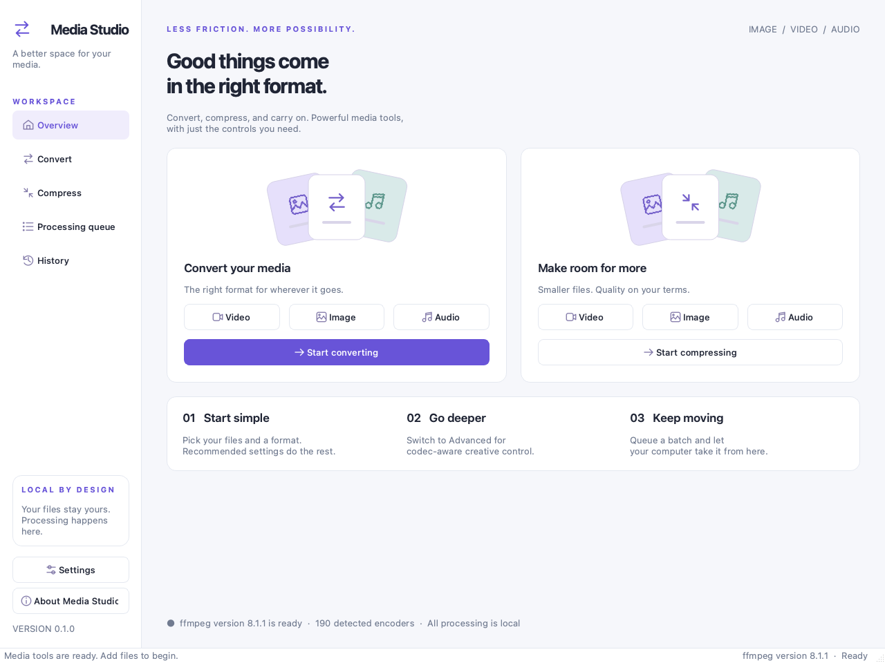
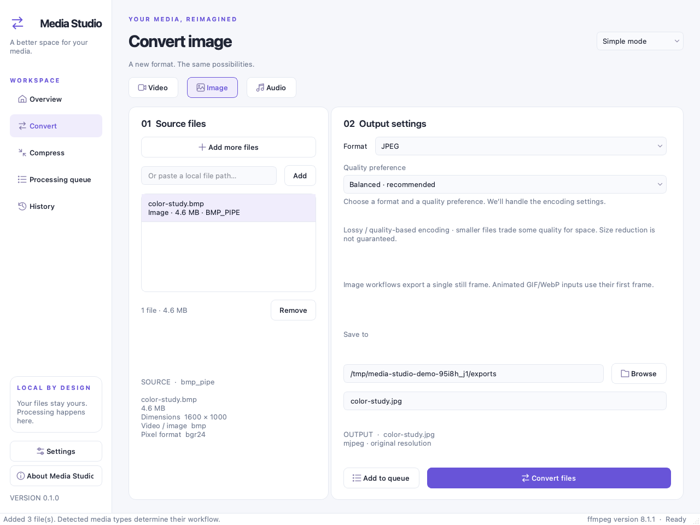
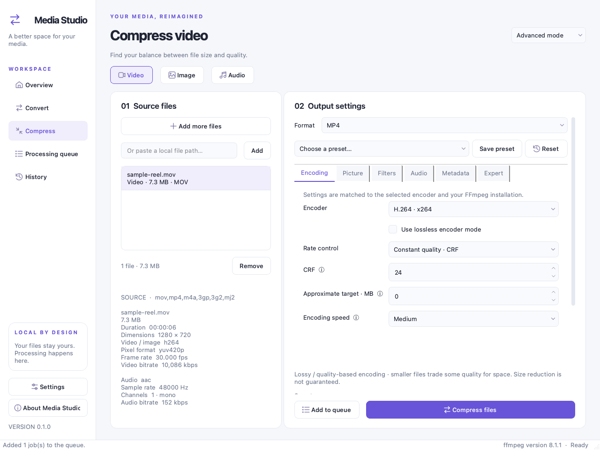
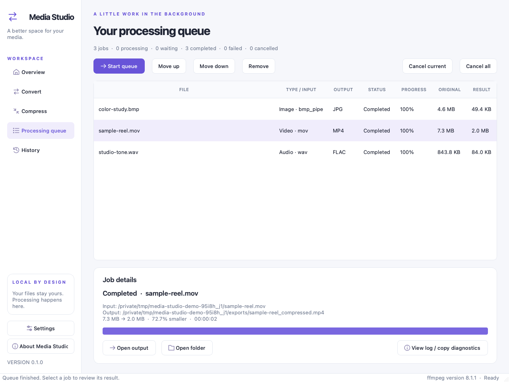
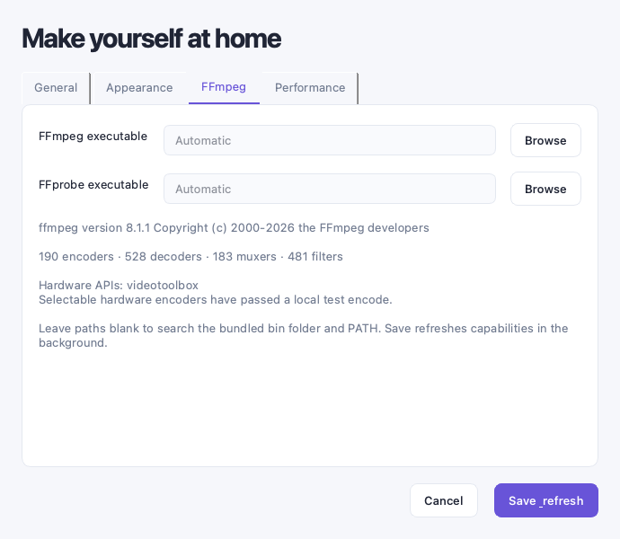
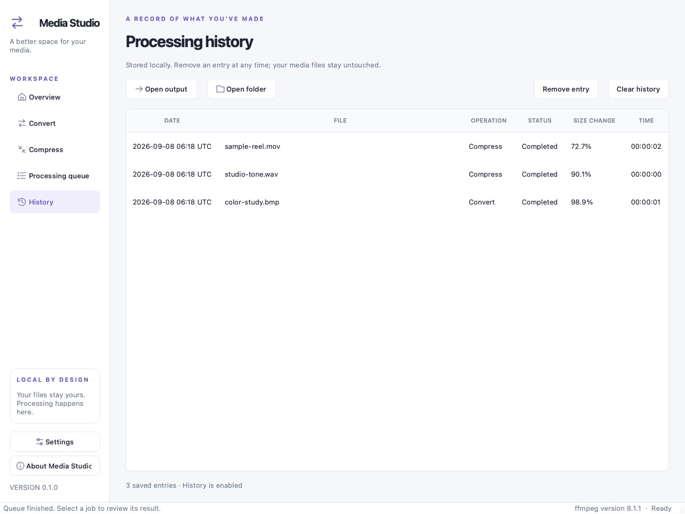
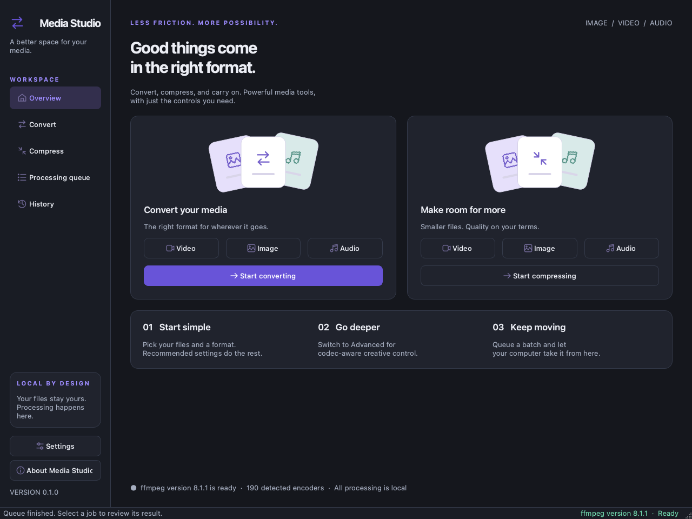

# Media Studio

**Convert and compress images, video, and audio in a native desktop app.**

Media Studio brings FFmpeg into a Python and PySide6 interface with two ways to work: **Simple mode** for choosing a format and quality preference, and **Advanced mode** for controlling the encoder and media settings. Both modes use the same analysis, validation, and processing engine. Your media stays on your computer.



*Screenshots show the actual application using generated sample media. Queue results come from real FFmpeg jobs. Available formats, encoder counts, processing times, and file sizes depend on your installation and source files.*

## Contents

- [Features](#features)
- [Requirements](#requirements)
- [Installation and launch](#installation-and-launch)
- [Your first conversion](#your-first-conversion)
- [Compression and quality](#compression-and-quality)
- [Advanced mode and presets](#advanced-mode-and-presets)
- [Batch processing and results](#batch-processing-and-results)
- [Settings and history](#settings-and-history)
- [Supported formats and encoders](#supported-formats-and-encoders)
- [File safety and privacy](#file-safety-and-privacy)
- [Troubleshooting](#troubleshooting)
- [Development](#development)
- [Packaging](#packaging)
- [Current limitations](#current-limitations)
- [Contributing](#contributing)
- [License and acknowledgments](#license-and-acknowledgments)

## Features

| Feature | What you can do |
| --- | --- |
| Six workflows | Convert or compress images, video, and audio independently. |
| Simple and advanced modes | Start with recommended settings or adjust media-specific controls without writing an FFmpeg command. |
| Source inspection | Read actual media properties with FFprobe, including codecs, dimensions, duration, frame rate, audio properties, and size. |
| Capability detection | Choose from supported combinations of installed encoders, muxers, pixel formats, sample formats, and filters. |
| Batch queue | Add multiple files, reorder waiting jobs, process up to four jobs concurrently, and cancel current or queued work. |
| Live progress and results | See progress, elapsed time, speed and estimated remaining time when available, then compare actual input and output sizes. |
| Presets | Use built-in settings, save custom presets, and restore recommended settings. |
| File protection | Keep sources intact, resolve filename conflicts, and remove incomplete temporary outputs after failure or cancellation. |
| Local history | Reopen completed outputs, inspect diagnostics, and optionally retain a history of jobs. |
| Appearance | Choose light, dark, or system theme. The interface follows operating-system display scaling. |

## Requirements

- **Python 3.11 or later**, with a compatible PySide6 wheel for your platform.
- **FFmpeg and FFprobe** executables that can both start successfully.
- A desktop graphical session for normal use and sufficient free space in the output folder.
- A display that accommodates the application's minimum **980 × 720** window size.

PySide6 is installed with the Python package. FFmpeg and FFprobe are separate dependencies. Install them through your platform's package manager or use a build linked from the [official FFmpeg download page](https://ffmpeg.org/download.html).

The application is designed for macOS, Windows, and Linux. Local validation has been performed on macOS; the repository also includes an [Ubuntu CI workflow](.github/workflows/test.yml). Signed installers and Windows/Linux release binaries have not been validated.

After installing the dependencies, processing does not require an account, API key, web server, or internet connection.

## Installation and launch

Run the following commands from the repository root.

### 1. Verify the media tools

```sh
ffmpeg -version
ffprobe -version
```

Both commands should display version information. If the tools are outside `PATH`, you can select their executable files or containing directory in **Settings → FFmpeg** after launching the app.

### 2. Install the application

Choose one of these methods.

**Using uv**

The repository includes `uv.lock` for dependency resolution.

```sh
uv sync
uv run media-studio
```

**Using pip on macOS or Linux**

```sh
python3 -m venv .venv
source .venv/bin/activate
python -m pip install -e .
python -m media_studio
```

**Using pip on Windows PowerShell**

Activation is optional; calling the virtual environment's Python directly also avoids PowerShell activation-policy issues.

```powershell
py -3 -m venv .venv
.\.venv\Scripts\python.exe -m pip install -e .
.\.venv\Scripts\python.exe -m media_studio
```

Ensure that `py -3` selects Python 3.11 or later. If you do not use the Windows Python launcher, substitute the path to a compatible Python executable.

### 3. Launch again

With the virtual environment active, use either command:

```sh
media-studio
python -m media_studio
```

On Windows, `.\.venv\Scripts\media-studio.exe` uses the GUI entry point and does not require a console window. From a source checkout with dependencies installed, `python main.py` is another supported entry point.

The home screen reports when FFmpeg is ready. If either executable fails to start, the app shows a graphical error with diagnostic details. See [Troubleshooting](#troubleshooting) for missing tools and the Homebrew library issue encountered during development.

## Your first conversion

For example, to convert an image to JPEG:

1. Select **Convert → Image** from the overview.
2. Click **Browse files**, paste a local path and click **Add**, or drop files into the source area.
3. Keep **Simple mode** selected. Review the source properties detected by FFprobe.
4. Choose **JPEG** as the output format and select a quality preference.
5. Choose a destination under **Save to**. Leaving it blank uses the source folder. Optionally enter an output filename.
6. Click **Convert files**. The app validates the settings and opens the processing queue.
7. Select the completed job, then use **Open output** or **Open folder**.



The same workflow applies to **Video** and **Audio**. Media types are detected from file contents instead of the filename alone. If you add mixed media, the files are grouped into their detected workflows; switch media tabs to work with each group.

For multiple files, one set of settings applies to the current media group, and filenames are generated individually. The output extension follows the selected format. Conversion normally keeps the source stem; compression adds `_compressed`. Source-name conflicts receive a different name, and existing outputs follow the configured **Ask / Rename / Replace** policy.

## Compression and quality

Choose **Compress**, select a media type, add files, and choose a format and quality preference. The app initially keeps a matching source format when supported. You can change the output format when that better suits your goal—for example, WAV to FLAC for lossless audio encoding or BMP to PNG for lossless image encoding.

Simple mode offers **High quality**, **Balanced**, **Smaller file**, and **Maximum compression** preferences. Their effect depends on the encoder. A PNG or FLAC workflow uses lossless compression controls rather than lossy quality reduction.

| Operation | Quality implications |
| --- | --- |
| PNG re-encoded as PNG | Stronger compression effort can reduce size without intentionally changing the encoder's input pixels. |
| WAV encoded as FLAC | Lossless encoding is available; sample rate, channel, bit-depth, or filter changes can still alter the audio. |
| PNG/BMP converted to JPEG | Lossy encoding. JPEG cannot retain alpha transparency; the recommended image settings composite onto a background. |
| H.264/HEVC/AV1 re-encoded normally | Quality-based or bitrate-based lossy encoding. Lower bitrate or stronger compression can discard detail. |
| MP3/AAC/Opus encoding | Lossy encoding; bitrate and supported quality modes control the tradeoff. |
| Compatible streams copied | No generational encoding loss for the copied streams; container compatibility still matters. |

**Lossless describes the encoding mode, not a guarantee that every processing step preserves the original.** Resizing, color or sample conversion, gain, normalization, and channel mixing can change media before it reaches a lossless encoder.

Compression is not guaranteed to make a file smaller. Already compressed media can grow, and the result screen reports either a reduction or an increase.

### Approximate video target size

In **Advanced mode → Encoding**, supported lossy video encoders offer **Approximate target · MB**. `0` disables it. A positive value estimates video bitrate from duration and the target size, subtracting the audio bitrate and allowing 2% for container overhead:

```text
Estimated video kbps = (target MB × 1,000,000 × 8 ÷ duration seconds ÷ 1,000) × 0.98
                       − estimated audio kbps
```

The target uses decimal MB and is approximate. Media content, audio rate control, codec behavior, and container overhead affect the final size. Supported two-pass bitrate modes can improve bitrate allocation but do not guarantee an exact file size.

## Advanced mode and presets

Switch the mode selector to **Advanced mode** to expose controls that apply to the selected media type and encoder. Related settings are grouped into tabs. Hover over controls marked **ⓘ** for context, and scroll within the settings panel to reach output details and the read-only command preview.



| Media | Available controls, where supported |
| --- | --- |
| Image | Encoder, quality, lossless mode, compression effort, dimensions/fit/percentage, aspect ratio, scaler, compatible pixel formats, transparency handling and background color, filters, color tags, metadata |
| Video | Encoder, CRF/average bitrate/constrained CBR, encoding speed, bitrate limits and buffer, two-pass mode, approximate target size, dimensions/FPS, compatible pixel format, applicable profile/level/GOP/B-frames, filters, separate audio settings, subtitles, chapters, metadata, MKV attachments |
| Audio | Encoder or stream copy, bitrate or supported quality/VBR/CBR mode, FLAC compression effort, sample rate/format/channels, gain, loudness normalization, metadata editing, supported cover-art preservation/replacement/removal |

### Use or save a preset

Select **Choose a preset…** to load an available built-in or custom preset. Examples include MP4 compatibility, high-quality H.264, small H.265, FFV1 archive, lossless PNG, JPEG quality presets, MP3/AAC presets, Opus voice/music, FLAC lossless, and uncompressed WAV. Presets that require unavailable built-in encoders are omitted.

To create your own preset, configure Advanced mode, click **Save preset**, and enter a name. Reusing an existing custom name replaces its saved settings. Custom presets are stored locally and reusable in later sessions.

**Reset** restores recommended settings for the current media type, operation, format, and quality preference. Changing the format or encoder can reset incompatible settings; review the controls and command preview afterward.

### Copy without re-encoding

In advanced video or audio conversion, choose **Copy without re-encoding** as the encoder. Video also has a separate **Audio handling** choice for copying or removing its audio track.

Copy mode is useful for compatible container changes. It cannot resize, filter, resample, or otherwise transform the copied stream. The app checks supported codec/container combinations and explains when re-encoding is required. It processes the first primary video/audio track; arbitrary multi-track selection is not implemented.

### Expert output arguments

The **Expert** tab accepts additional output option/value pairs, such as `-aq-strength 0.8`. These can override generated settings and can fail if an encoder does not support them. Ordinary workflows never require this field.

The supported option names are:

```text
-aq-mode -aq-strength -rc-lookahead -sc_threshold -qcomp -qblur
-slices -slice-max-size -compression_level -global_quality -qmin -qmax
-max_muxing_queue_size -frame_duration -application -tune -deadline
-row-mt -tile-columns -tile-rows -cutoff -aac_coder -dither_method
```

Extra inputs or outputs, arbitrary filter graphs, and filesystem/network arguments are not accepted here.

## Batch processing and results

Use **Add to queue** to collect jobs without starting them, or **Convert files / Compress files** to add the current batch and start processing waiting jobs. Every queued job retains the settings selected when it was added.

The **Processing queue** shows the filename, detected input type, output format, status, progress, and actual sizes. Select a waiting job and use **Move up**, **Move down**, or **Remove** to organize the queue. **Settings → Performance** controls concurrency from one to four jobs.

During encoding, select a job to see elapsed time, processed timestamp, speed, and estimated remaining time when available. **Cancel current** stops a running job; **Cancel all** stops active work and cancels waiting jobs. Incomplete temporary outputs are removed. Add a new job from the conversion/compression screen to retry after a failure or cancellation.



Completed jobs show their output path, size difference, and processing duration. **Open output** and **Open folder** let you inspect the result. Double-click a job or click **View log / copy diagnostics** to inspect its command and FFmpeg output. Failed jobs show an explanation rather than silently disappearing.

The queue and diagnostic logs are kept in memory for the current session. Waiting or interrupted jobs are not restored after restarting the app.

## Settings and history

Open **Settings** from the sidebar. **Save & refresh** saves preferences and refreshes FFmpeg capabilities in the background.

| Tab | Settings |
| --- | --- |
| General | Default output folder, asking for a destination, opening completed folders, filename conflict policy, remembering settings, processing history |
| Appearance | Light, dark, or follow-system theme |
| FFmpeg | Executable paths, version, detected capabilities, and hardware API information |
| Performance | One to four simultaneous jobs and a default CPU thread preference; `0` threads lets FFmpeg decide |



The **History** page retains up to 500 entries when history is enabled. It records timestamps in UTC, operation, paths, formats, sizes, status, and duration. You can reopen successful outputs, remove individual entries, or clear the history. Removing history does not delete media files.

<details>
<summary>Screenshot: processing history</summary>



</details>

<details>
<summary>Screenshot: dark theme</summary>



</details>

Keyboard shortcuts follow Qt's platform conventions: **Ctrl+O / ⌘O** opens file selection, **⌘,** opens settings on macOS, and **Ctrl+Q / ⌘Q** quits where those standard shortcuts apply.

## Supported formats and encoders

These are the output formats covered by the application's compatibility registry. **A format appears only when the required muxer and at least one implemented compatible encoder are installed.** This table is not a promise that every FFmpeg build provides every entry.

| Media | Output formats in the registry |
| --- | --- |
| Image | PNG, JPEG, WebP, AVIF, TIFF, BMP, GIF, JPEG 2000 |
| Video | MP4, MKV, MOV, WebM, AVI, MPEG, MPEG-TS, M4V |
| Audio | MP3, M4A, AAC, WAV, FLAC, Ogg, Opus, AC-3, WMA |

Input support depends on FFmpeg/FFprobe's demuxers and decoders and on the presence of a supported media stream. The app examines file contents rather than trusting the extension.

At startup, Media Studio queries encoders, decoders, muxers, filters, and hardware APIs. Encoder help supplies supported pixel formats, sample formats, rates, and private-option information. Controls use supported, implemented options; the app does not expose every possible FFmpeg flag. Container/encoder compatibility is curated in [capabilities.py](media_studio/core/capabilities.py), then filtered against the installed build.

Software encoder families include x264/H.264, x265/HEVC, SVT-AV1/libaom AV1, VP9, MPEG, ProRes, FFV1, and the supported image/audio encoders. Apple VideoToolbox H.264/HEVC choices appear only after a local test encode succeeds. Detecting a hardware API alone does not establish that a device can encode; other hardware encoder families are not exposed in this version.

## File safety and privacy

- **Original sources are protected**, including recognized symbolic-link and hard-link aliases. Output cannot intentionally replace its source through the normal workflows.
- Existing outputs use **Ask**, **Rename**, or **Replace**; **Ask** is the default. Queue reservations also protect loaded sources and queued destinations.
- FFmpeg receives an argument list without a shell. Each job writes to a unique temporary file in the output directory before publishing a successful result.
- Failure or cancellation removes the incomplete temporary file and leaves a previous output intact. Non-replacement publication uses a same-filesystem hard link to prevent a late filename collision from overwriting another file. Filesystems without hard-link support fail safely in this mode.
- Files are processed locally. The application does not upload media or send it to an external service.

Preferences, custom presets, and optional history are saved as atomic JSON files:

| Platform | Default application data directory |
| --- | --- |
| macOS | `~/Library/Application Support/Media Studio/` |
| Windows | `%APPDATA%/Media Studio/` |
| Linux | `${XDG_CONFIG_HOME:-~/.config}/media-studio/` |

The files are `settings.json`, `presets.json`, and `history.json`. Set **`MEDIA_STUDIO_DATA_DIR`** to use a different directory, for example:

```sh
MEDIA_STUDIO_DATA_DIR=/path/to/private-settings media-studio
```

Disable processing history in Settings to stop new entries, and clear existing entries from History if desired. Remembered settings and custom presets remain separate from history. Diagnostic logs stay in memory and include local filenames and commands; review them before copying and sharing them.

## Troubleshooting

| Problem | What to check |
| --- | --- |
| FFmpeg or FFprobe cannot start | Run both `-version` commands, check executable permissions and dependencies, then choose working paths in **Settings → FFmpeg**. |
| A format or preset is missing | Its required encoder or muxer may be absent. Install a suitable FFmpeg build and use **Save & refresh**. |
| A hardware encoder is missing or fails | A usable device may be unavailable even if FFmpeg lists the API. Choose a software encoder. |
| Copy mode is rejected | The stream may not fit the output container, or a transformation requires decoding. Remove those transformations or choose an encoder. |
| Subtitles cannot be preserved | Choose compatible subtitle copy, convert supported text subtitles, use MKV where appropriate, or remove subtitles. Image-based subtitles cannot be converted to text by this app. |
| Output is larger than the input | Compression is content-dependent. Try a lossy smaller-file profile, another format, or a reduced size/rate if changing quality is acceptable. |
| An image animation becomes a still | Image workflows intentionally export only the first frame. Animation-preserving conversion is not implemented. |
| The destination is inaccessible or publication fails | Check folder permissions, free disk space, filename conflicts, and hard-link support. Retry in an appropriate local filesystem. |
| History cannot open an output | The file may have been moved or deleted after the job completed. History stores its original output path. |
| A job fails with custom settings | Review the job log, remove Expert arguments, or use **Reset** to restore recommended settings. |
| Preferences fail to save | Check permissions on the application data directory or set `MEDIA_STUDIO_DATA_DIR` to a writable location. |

### Homebrew shared-library mismatch on macOS

During development, the installed FFmpeg referenced `libx265.216.dylib`, while the active Homebrew x265 path exposed version 217. The matching older library was still present. The following **machine-specific, process-local workaround** allowed launch and validation without modifying Homebrew:

```sh
DYLD_FALLBACK_LIBRARY_PATH=/opt/homebrew/Cellar/x265/4.2/lib .venv/bin/media-studio
```

Use that exact path only if the matching library exists on your machine. It is not a general installation requirement. A working FFmpeg installation needs no override; otherwise repair the installation or configure another working build.

## Development

### Install development dependencies

```sh
uv sync --extra dev
```

Or, with a virtual environment active:

```sh
python -m pip install -e '.[dev]'
```

### Run checks

```sh
python -m pytest -q
ruff check media_studio tests scripts main.py
ruff format --check media_studio tests scripts main.py
```

The test fixtures default to Qt's `offscreen` platform, so a visible desktop window is not required. Tests generate real media and cover all six workflows, available format defaults, decoded PNG/FLAC lossless equality, source inspection, subtitles, metadata, artwork, two-pass sizing, resize/FPS, cancellation, overwrite protection, filename races, validation, GUI controls, batch concurrency, and history behavior.

Integration tests **skip** if FFmpeg/FFprobe cannot start; format-specific cases skip unavailable encoders. Review the skip summary instead of treating missing-tool skips as successful media validation. The local macOS run at the time of documentation completed **66 tests with 1 WebP skip** because that build lacked a supported WebP encoder. This is a recorded local result, not a guarantee for every platform or FFmpeg version.

| Environment variable | Purpose |
| --- | --- |
| `TEST_FFMPEG` | Override the FFmpeg executable used by tests and the screenshot helper |
| `TEST_FFPROBE` | Override the FFprobe executable used by tests and the screenshot helper |
| `QT_QPA_PLATFORM=offscreen` | Render Qt without a visible desktop; useful for checks and screenshots, not normal interactive use |
| `MEDIA_STUDIO_DATA_DIR` | Override the application's local preference/history directory |

The [CI workflow](.github/workflows/test.yml) installs FFmpeg and Qt runtime libraries on Ubuntu, installs development dependencies, then runs lint and the tests.

### Architecture

The GUI manages navigation and user interaction. Background tasks handle capability detection, media inspection, validation, and execution. Command generation and processing remain usable independently of Qt, so Simple and Advanced modes share the same engine.

```text
media_studio/
  app.py                 Application startup
  models.py              Media, options, jobs, progress, and errors
  presets.py             Recommended settings and built-in presets
  storage.py             Atomic preferences, custom presets, and history
  core/
    capabilities.py      Executable discovery and compatibility registry
    probe.py             FFprobe media inspection
    validation.py        Configuration, compatibility, and path checks
    commands.py          Command generation and two-pass plans
    execution.py         Progress, cancellation, logs, and output publication
    process.py           Shared subprocess behavior
  gui/
    main_window.py       Navigation, workers, queue orchestration, and history
    workbench.py         Six Simple/Advanced workflows
    editor.py            Encoder-aware settings controls
    queue_page.py        Progress, results, and diagnostics
    settings.py          Preferences dialog
    workers.py           Qt thread-pool tasks and signals
    widgets.py           Shared controls, icons, and illustrations
    theme.py             Light, dark, and system themes
    assets/              SVG control assets
tests/                   Engine, storage, and GUI checks
scripts/
  capture_screenshots.py  Documentation capture helper
docs/screenshots/        Screenshots used in this README
```

### Refresh the screenshots

With the app installed and working FFmpeg/FFprobe tools available:

```sh
python scripts/capture_screenshots.py
```

The helper creates isolated temporary preferences and synthetic BMP, MOV, and WAV samples, renders the actual Qt widgets offscreen, and processes real JPEG, MP4, and FLAC jobs. It saves seven PNG screenshots under `docs/screenshots/` and removes its temporary media afterward. It does not read your personal media or preferences. The demo requires the corresponding encoders, including x264, AAC, JPEG, and FLAC.

Use `--output /path/to/screenshots` to select another capture directory. Screenshot content reflects the current FFmpeg build; timings, generated paths, and history timestamps will vary. Review the images after refreshing them.

## Packaging

### Python distributions

```sh
uv build
```

The wheel and source archive are written under `dist/`. They contain the Python application and packaged GUI assets, not FFmpeg itself.

### Native application bundles

The repository includes a [PyInstaller specification](media-studio.spec). Build separately on each target operating system:

```sh
python -m pip install pyinstaller
python -m PyInstaller media-studio.spec
```

The specification creates `dist/Media Studio/` and, on macOS, `dist/Media Studio.app`. It uses a GUI entry point rather than a console application.

If bundling FFmpeg, place compatible standalone FFmpeg/FFprobe executables and their required accompanying libraries in the repository's `bin/` directory before building. Otherwise, users can configure installed executables. Explicit paths in Settings take precedence; automatic discovery checks the checkout/bundle's `bin/` directory and then `PATH`.

The Python wheel and source archive have been built locally. The PyInstaller specification is provided for release work; signed/notarized installers and native release bundles have not been produced or verified. Check the redistribution obligations of the specific Qt and FFmpeg builds you package.

## Current limitations

- Image workflows export **a single still frame**, including for animated GIF/WebP inputs.
- Processing uses the first primary video/audio stream. Arbitrary multi-track selection is not available.
- Target file sizes and remaining-time estimates are approximate; compression can increase file size.
- Color controls tag output characteristics; they do not provide color-managed grading or HDR tone mapping.
- Audio loudness normalization is single-pass; two-pass loudness normalization is not implemented.
- Video two-pass bitrate support is implemented for x264, VP9, and MPEG-4, rather than every encoder.
- Hardware encoding choices are limited to locally tested Apple VideoToolbox encoders.
- The compatibility registry covers implemented combinations, not every format and option in FFmpeg. Unusual valid-looking settings can still fail at runtime and produce a diagnostic log.
- Queue restoration, trimming, watermarking, animation preservation, and arbitrary FFmpeg graph editing are not implemented.
- Non-replacement output publication requires hard-link support on the destination filesystem.

## Contributing

Keep GUI behavior separate from command generation and process management. When adding a format or encoder, update the compatibility registry, encoder-aware controls, presets where relevant, validation, and the command builder together. Verify it with real FFmpeg output as well as meaningful safety or behavior checks.

Run the development checks before submitting changes. Update the README and refresh affected screenshots when a workflow changes. For bug reports, include the app/FFmpeg versions, operating system, selected workflow and settings, expected behavior, and relevant diagnostic output. Remove private paths or metadata before sharing logs, and provide a small reproducible sample only when you can share it.

## License and acknowledgments

Media Studio retains the repository's **GNU General Public License v2**; see [LICENSE](LICENSE). Qt/PySide6 and FFmpeg retain their own licenses, which depend on how those dependencies are built and distributed.

The application uses [FFmpeg for processing](https://ffmpeg.org/ffmpeg.html), [its encoder-specific options](https://ffmpeg.org/ffmpeg-codecs.html), FFprobe for inspection, and [Qt's thread pool](https://doc.qt.io/qtforpython-6/PySide6/QtCore/QThreadPool.html) for background work.
